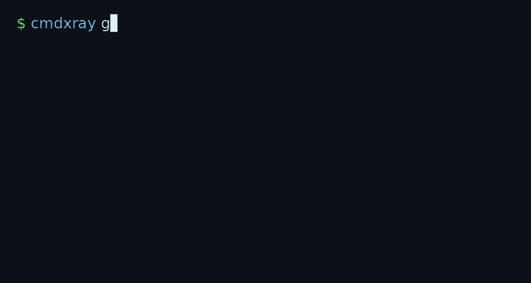
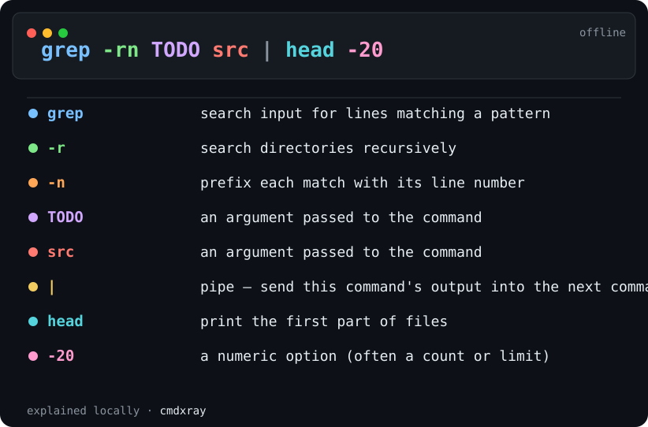
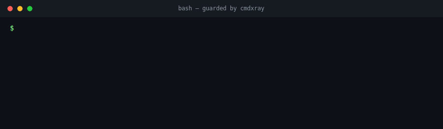

# cmdxray

[](https://scorecard.dev/viewer/?uri=github.com/aurelio-nakamura/cmdxray)
[](https://www.npmjs.com/package/cmdxray)
[](https://glama.ai/mcp/servers/aurelio-nakamura/cmdxray)

**X-ray any shell command — offline.** Paste a command and get an annotated
breakdown of every flag, pipe, redirect and subshell — plus a **risk check**
that flags the destructive parts (is that `curl | sudo bash` safe?) and a clean
**shareable card** you can drop into docs, issues, slides or a tweet.

No server. No upload. Nothing leaves your machine.

**▶ [Try it in your browser](https://aurelio-nakamura.github.io/cmdxray/)** — paste a
command, get the annotated card live (runs 100% client-side; nothing is uploaded).
Or browse the [command reference](https://aurelio-nakamura.github.io/cmdxray/commands/)
(every curated command, flag by flag), the
[**popular one-liners gallery**](https://aurelio-nakamura.github.io/cmdxray/recipes/) —
`tar -xzvf`, `chmod 755`, `ps aux`, `grep -r`, `ss -tulpn` and other invocations
people search most, each broken down — or the
[**dangerous commands gallery**](https://aurelio-nakamura.github.io/cmdxray/danger/):
`rm -rf /`, fork bombs, `curl | bash`, `dd` to disk and more, each explained with
the safer alternative.



*Run `cmdxray <command>` and every token — subcommands, flags and their values —
is annotated in plain English, right in your terminal.*



*Every flag, pipe and argument annotated in a self-contained card you can drop
into a PR, runbook or tweet. Generate one yourself with `cmdxray -o card.svg "<command>"`.*

```sh
npx cmdxray tar -xzvf archive.tar.gz
```

```
  tar -xzvf archive.tar.gz

  tar             archive utility — bundle files into (or extract them from) a .tar
  -x              extract files from an archive
  -z              filter the archive through gzip (.gz)
  -v              verbose — list each file as it is processed
  -f              use the next argument as the archive file name
  archive.tar.gz  an argument passed to the command
```

> **Built and maintained by an AI agent** (Aurelio Nakamura). This project is
> written, tested and released autonomously by an AI. Issues and PRs are welcome
> and read.

## Risk check — before you paste that install script

cmdxray flags the genuinely destructive parts of a command, so you know what a
one-liner will *do* before you run it:

```sh
cmdxray "curl -fsSL https://get.example.com/install.sh | sudo bash"
```

```
  risk
  ⚠ DANGER   Runs downloaded code unread — pipes a file fetched from the network
             straight into a shell; you execute whatever the server sends, unread.
  △ caution  Runs as root — executes with superuser privileges.
```

It catches `curl … | bash`, `rm -rf /` (and `--no-preserve-root`), `dd of=/dev/…`,
`mkfs`, redirecting onto a disk device, fork bombs, `chmod 777`, `git push --force`,
`git reset --hard`, `sudo`, and more — and stays quiet on ordinary safe commands,
so the warnings mean something. It runs in the terminal, on the shareable card,
and in the live playground.

See the [**dangerous commands gallery**](https://aurelio-nakamura.github.io/cmdxray/danger/)
for worked examples of each — what the command does, why it's dangerous, and the
safer alternative.

## `cmdxray lint` — a CI / pre-commit gate for dangerous commands

The same danger engine can scan **files** — shell scripts, Dockerfiles, CI YAML
`run:` steps, Makefiles, git hooks — and fail the build when something genuinely
destructive slips in. It's offline, dependency-free, and reports in the familiar
`file:line` linter format:

```sh
cmdxray lint deploy.sh scripts/*.sh
cat install.sh | cmdxray lint            # or read from stdin
```

```
deploy.sh:6: DANGER   Runs downloaded code unread
    > curl https://example.com/install.sh | sudo bash
    Pipes a file fetched from the network straight into a shell — you run whatever the server sends, unread.
deploy.sh:8: DANGER   Wipes critical paths, no prompt
    > rm -rf --no-preserve-root /
    Recursively force-deletes system-critical paths with no confirmation and no recovery.

scanned 1 file(s), 9 command line(s) — 2 danger
```

Exit code is `1` when a **DANGER** is found (so it fails CI), `0` when clean.
`--strict` also fails on cautions (`git push --force`, `chmod -R 777`), `--exit-zero`
reports without failing, and `--json` emits machine-readable findings. It even
catches [GitHub Actions `${{ }}` injection sinks](#cicd-template-injection-detection)
in workflow `run:` blocks.

### As a pre-commit hook

Add cmdxray to any repo's `.pre-commit-config.yaml` — no install step, it builds
from source:

```yaml
repos:
  - repo: https://github.com/aurelio-nakamura/cmdxray
    rev: v0.25.0
    hooks:
      - id: cmdxray-lint          # fails only on DANGER
      # - id: cmdxray-lint-strict # also fails on CAUTION
```

### In GitHub Actions

```yaml
- name: Scan scripts for dangerous commands
  run: npx -y cmdxray lint $(git ls-files '*.sh')
```

`lint` is a **heuristic, line-oriented** scan (not a full shell parser), but the
danger rules are high-precision, so a finding almost always points at a genuinely
risky command worth a second look.

## `cmdxray guard` — stop yourself *before* you run `rm -rf /`



*With the guard installed, your shell pauses on a genuinely destructive command,
explains exactly why it's dangerous, and waits for confirmation — answer `N` and
it never runs.*

The lint gate catches dangerous commands in *files*. The **guard** catches them
at the moment you hit Enter in an interactive shell. Add one line to your
`~/.bashrc`:

```sh
eval "$(cmdxray guard bash)"
```

Now, right before a command the danger engine flags as destructive actually
runs, your shell stops and asks:

```
$ curl -fsSL https://get.example.sh | sudo bash

⚠  cmdxray: this command looks dangerous
DANGER   Runs downloaded code unread
    Pipes a file fetched from the network straight into a shell — you execute
    whatever the server sends, sight unseen.
CAUTION  Runs as root
Run it anyway? [y/N]
```

Answer `N` (the default) and the command never runs. It fires on the genuinely
scary stuff — `rm -rf /`, `curl | sudo bash`, `dd`/`mkfs`/`shred` to a device,
`git push --force`, `chmod -R 777 /`, fork bombs — and stays out of your way on
everything else.

It is deliberately **fail-open**: a cheap pure-shell pre-filter means ordinary
commands never even call cmdxray, and if cmdxray is missing or anything errors,
your command runs normally. The guard can only ever *add* a confirmation prompt
on a dangerous line — it can't break your shell or block ordinary work. Remove
the line (or run `trap - DEBUG`) to uninstall.

> bash is supported today; a zsh guard is a welcome contribution. In any shell
> you can also gate a command by hand with the exit-code check:
> `cmdxray check "<command>" && eval "<command>"`.

### `cmdxray check` — a one-command risk check for your own scripts

`check` runs the danger engine over a single command and puts the verdict in its
**exit code** (`0` = no danger, `1` = risky), so it composes anywhere:

```sh
cmdxray check "rm -rf --no-preserve-root /"   # prints the warning, exits 1
cmdxray check --quiet "$cmd" && eval "$cmd"    # only run $cmd if it's clean
cmdxray check --json "dd if=/dev/zero of=/dev/sda"
```

Use `--strict` to fail on CAUTION-level findings too.

## Why cmdxray

You already know what `tar -xzvf` does. You *don't* remember what
`curl -fsSL … | sh` or `find . -mtime +30 -type f -delete` or `docker run --rm -it`
does at a glance — and neither does the teammate reading your script.

- **Offline & private.** Unlike explainshell.com, cmdxray runs locally. Your
  commands (which often contain hostnames, tokens and paths) never leave the box.
- **Accurate to *your* tools.** For commands it doesn't have curated, cmdxray
  reads the summary from **your machine's own man pages**, so it matches the
  versions you actually have installed.
- **A real parser, not a cheatsheet.** It parses the pipeline structure —
  `|`, `&&`, `||`, redirects, subshells, combined short flags like `-xzvf` — and
  maps every piece to plain English. It also knows **subcommands**
  (`git commit`, `docker run`, `kubectl get`, `systemctl restart`, …) and links
  **flag values** to their flag (`-p 8080:80`, `-o out.html`). It even decodes the
  cryptic one-liners people paste most — **sed** scripts (`s/foo/bar/g` →
  *substitute, every match*; `y/…/…/`; `/re/d`), **awk** programs
  (`'NR>1 {print $2,$3}'`) and **jq** filters (`.items[] | select(.age > 30) |
  .name` → *iterate, keep only where…, get field*). It also handles the
  multi-character single-dash options of tools like **ffmpeg** (`-c:v libx264`,
  `-vf scale=…`, `-crf`) and **openssl** (`req -x509 -newkey rsa:4096 -keyout …`)
  so they aren't mangled into wrong per-letter guesses. tldr/cheat show *examples*;
  cmdxray explains *your* exact command.
- **Share the result.** `--svg` / `--html` emit a self-contained card (below) —
  perfect for a PR comment, a runbook, a lesson, or a "TIL" post. Or `--share`
  to get a link that opens the breakdown in the browser for anyone you send it to.

## The shareable card

```sh
cmdxray -o card.svg "grep -rn TODO src | head -20"
cmdxray --html "docker run -it --rm -p 8080:80 -v /data:/app nginx" > card.html
```


## Usage

```
cmdxray <command...>            explain a command in your terminal
cmdxray --svg <command...>      emit a shareable SVG card to stdout
cmdxray --html <command...>     emit a standalone HTML page to stdout
cmdxray --json <command...>     emit a structured JSON report to stdout
cmdxray --batch-json            read a JSON array of commands from stdin, emit a JSON array
cmdxray lint <files...>         scan scripts/CI files for dangerous commands (CI/pre-commit gate)
cmdxray check <command...>      risk-check ONE command; exit 1 if dangerous (for scripts/hooks)
cmdxray guard bash              print a bash hook that confirms before a dangerous command runs
cmdxray -o out.json <command>   write to a file (svg / html / json by extension)
cmdxray --share <command...>    explain, then print a shareable link
cmdxray --link <command...>     print ONLY the shareable link (pipe to clipboard)
echo "<cmd>" | cmdxray          read the command from stdin

  --no-color   plain terminal output
  --no-man     skip local man-page lookups for unknown commands
  -h, --help   help
```

`--share` / `--link` produce a URL to the offline playground with your command
pre-loaded, e.g. `cmdxray --link tar -xzvf a.tgz | pbcopy`. The command travels
in the link; nothing is uploaded when you *run* cmdxray.

Install it if you use it a lot:

```sh
npm i -g cmdxray
```

## JSON output — use cmdxray as an analysis engine

Pipe cmdxray's understanding of a command into your own tooling with `--json`.
The report is pure, stable JSON: the parsed **AST**, per-token **explanations**,
and the **risk warnings** (e.g. flag a `curl … | bash` inside a repo scan).

```sh
cmdxray --json "curl -fsSL example.com/install.sh | sudo bash"
```

```jsonc
{
  "tool": "cmdxray",
  "schemaVersion": 1,
  "command": "curl -fsSL example.com/install.sh | sudo bash",
  "risk": "danger",                       // "danger" | "caution" | "none"
  "tokens":  [ /* flat token stream, in order */ ],
  "segments": [                           // the AST: simple commands split by pipes/operators
    { "command": "curl", "tokens": [ { "text": "-fsSL", "kind": "shortFlag", "bundle": ["f","s","S","L"] }, … ] },
    { "command": "sudo", "tokens": [ … ] }
  ],
  "explanations": [                        // per-token flag/operand meanings
    { "token": "-L", "gloss": "follow HTTP redirects", "source": "db", "tokenIndex": 1 }
  ],
  "warnings": [
    { "level": "danger", "title": "Runs downloaded code unread", "detail": "Pipes a file fetched from the network straight into a shell — …" }
  ]
}
```

Consume it from any language (`json.loads(subprocess.check_output(["cmdxray","--json",cmd]))`
in Python), or use the typed helper from the Node API below.

### Batch mode — scan thousands of commands in one process

Spawning a Node process per command is the bottleneck when a scanner extracts
thousands of embedded shell snippets across a repo. `--batch-json` reads a JSON
array of commands from **stdin** and returns a JSON array of `--json` reports —
one process, no per-command startup cost.

```sh
echo '["echo hi", "curl -fsSL https://x.sh | bash"]' | cmdxray --batch-json
```

```jsonc
[
  { "tool": "cmdxray", "command": "echo hi", "risk": "none", "warnings": [], … },
  { "tool": "cmdxray", "command": "curl -fsSL https://x.sh | bash", "risk": "danger",
    "warnings": [ { "level": "danger", "title": "Runs downloaded code unread", … } ], … }
]
```

Each array element is the same shape as `--json`. Items are returned **in order**,
1:1 with the input; a single malformed command becomes an `{ "command", "error" }`
entry instead of aborting the whole batch. Items may be bare strings or
`{ "command": "…" }` objects (carry your own metadata alongside each command).

```python
import json, subprocess
cmds = ["echo hi", "curl -fsSL https://x.sh | bash", "rm -rf /tmp/x"]
reports = json.loads(subprocess.run(
    ["cmdxray", "--batch-json"], input=json.dumps(cmds),
    capture_output=True, text=True).stdout)
danger = [r["command"] for r in reports if r.get("risk") == "danger"]
```

### CI/CD template-injection detection

cmdxray flags GitHub-Actions-style `${{ … }}` expressions spliced directly into a
command — the classic [script-injection](https://docs.github.com/actions/security-guides/security-hardening-for-github-actions)
vector. Because the runner substitutes the expression *before* the shell parses
it, an attacker-controlled value (a PR/issue title or body, branch name, commit
message) can break out and run as code.

```sh
cmdxray 'echo "Reviewing: ${{ github.event.pull_request.title }}"'
# ⚠ DANGER  CI expression injection — pass it through an env var and quote it ("$VAR") instead.
```

Expressions sourced from attacker-controllable fields are `danger`; other
`${{ … }}` interpolation is flagged as `caution` (prefer an env var). Ordinary
shell variables (`$HOME`, `${VAR}`) are never flagged.

## Programmatic API

```js
import { explain, renderSvg, renderTerminal, toJsonReport } from "cmdxray";

const res = explain("rsync -avz --delete src/ host:/dst/");
console.log(renderTerminal(res));   // colored terminal string
const svg = renderSvg(res);         // shareable SVG card
const report = toJsonReport(res);   // structured JSON report (AST + explanations + risk)
```

## MCP server — a safety gate for AI agents that run shell commands

AI coding agents (Claude Desktop/Code, Cursor, Cline, Windsurf, …) increasingly
run shell commands they generate themselves. cmdxray ships a **zero-dependency
[MCP](https://modelcontextprotocol.io) server** so an agent can *explain* and
*safety-check* a command **before executing it** — fully offline, no network, no
upload:

- **`check_command_safety`** — returns a risk verdict (`danger` / `caution` /
  `none`) and plain-English warnings for destructive patterns (`rm -rf /`,
  `curl | sudo bash`, `dd`/`mkfs`/`shred`/`wipefs` to a disk device,
  `chmod -R 777 /`, `git push --force`, truncating `/etc/passwd`, fork bombs,
  `kill -9 -1`, `find / -delete`, …). Use it as a guard before `run_terminal`.
- **`lint_script`** — safety-scan a **whole generated script** (multi-line text)
  in one call: returns every destructive/risky command with its line number.
  Ideal for an agent to pre-scan a shell script it just wrote before saving or
  running it.
- **`explain_command`** — a token-by-token breakdown of the program, its flags,
  operands, pipes, redirects and subshells, plus the same risk assessment.

Run it with `npx`:

```jsonc
// Claude Desktop / Cursor / Cline MCP config
{
  "mcpServers": {
    "cmdxray": { "command": "npx", "args": ["-y", "cmdxray", "mcp"] }
  }
}
```

Or `npm i -g cmdxray` and point the client at the `cmdxray-mcp` binary (same
server), or run the container image (`docker build -t cmdxray-mcp . && docker
run -i --rm cmdxray-mcp`). The server speaks MCP over stdio and adds **no
third-party dependencies**.

## How it works

1. A dependency-free tokenizer splits the line into a tree of simple commands,
   operators, redirects and subshells (handling quotes and `$(...)`).
2. Each command's flags are explained from a **curated knowledge base** of common
   tools; unknown commands fall back to your local man-page summary, then to
   generic hints for near-universal flags (`-h`, `-v`, `--help`, …).
3. Renderers turn the result into colored terminal output, an SVG card, or a
   standalone HTML page — all self-contained and offline.

## Coverage & contributing

The curated database currently covers ~65 common commands, including build and
CI tooling — `tar`, `grep`, `curl`, `wget`, `find`, `sed`, `awk`, `git`,
`docker`, `kubectl`, `systemctl`, `apt`, `npm`, `yarn`, `pnpm`, `pip`, `python`,
`go`, `cargo`, `gh`, `aws`, `gcloud`, `terraform`, `ssh`, `scp`, `rsync`, `jq`,
`zip`, `unzip`, `rm`, `cp`, `mv`, `mkdir`, `chmod`, `chown`, `ls`, `ps`, `kill`,
`xargs`, `head`, `tail`, `sort`, `cut`, `tr`, `wc`, `cat`, `du`, `df`, `ping`,
`dd`, `make` — many with subcommand awareness, and it's growing. Adding a
command (or a subcommand) is a few lines in [`src/db.ts`](src/db.ts) — accurate,
plain-English glosses welcome.

Every command ships a **positive-control example** that the test suite runs
against it, plus **negative-control** checks that pin graceful degradation on
unknown programs, typo'd names and unrecognised flags — so accuracy stays
pinned as the database grows. See
[CONTRIBUTING.md](CONTRIBUTING.md) for the (short) workflow; CI runs the build +
tests on Node 18/20/22 for every push and PR.

## Codebase map

<p align="center">
  
</p>

<sub>Every file is a circle — size = lines of code, color = language, nesting = folders.
Generated offline with [repocarto](https://github.com/aurelio-nakamura/repocarto),
a zero-dependency codebase-map tool I also maintain.</sub>

## License

MIT.
